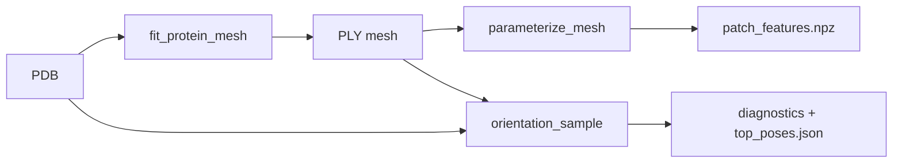

# GitHub upload checklist

Use this when pushing the **anisotropy** project as its own repository (or as a subfolder in a monorepo). Everything listed under [Include](#include) is required for a fresh clone to install and run; [Exclude](#exclude) keeps the repo small and avoids leaking local run data.

---

## Pipeline (what you are shipping)



| Step | Script | Main output |
|------|--------|-------------|
| 1 | `fit_protein_mesh.py` | SAS mesh `.ply`, shape JSON |
| 2 | `parameterize_mesh.py` | `patch_features.npz` (charges, pKa, chemistry) |
| 3 | `orientation_sample.py` | Orientation maps, `top_poses.json`, PNG diagnostics |
| optional | `visualize_patches.py` | Interactive PyVista viewer |

---

## Include

### Core package and CLIs

```
anisotropy/                    # Python package (all .py modules)
fit_protein_mesh.py
parameterize_mesh.py
orientation_sample.py
visualize_patches.py
ising_params.yaml              # Default Hamiltonian / sampler config
pyproject.toml
requirements.txt
LICENSE
README.md
.readthedocs.yaml
```

### Tests (recommended)

```
tests/
```

### Documentation (Read the Docs)

```
docs/
  conf.py
  index.rst
  getting_started.rst
  user_guide/
  hamiltonian/
  api/
  requirements.txt
  HYBRID_HAMILTONIAN_PARAMETERS.md
```

On [Read the Docs](https://readthedocs.org/): import repo → set **configuration file** to `.readthedocs.yaml` at repo root → Python 3.12 → build.

### ff19SB force field (required for default charges)

Default charge model uses AMBER **ff19SB** from the bundled library. You must include at least:

```
utils/ff19SB_201907-master/ff19SB_201907-master/forcefield_files/
  amino19.lib
  frcmod.ff19SB
  leaprc.protein.ff19SB
  … (other files in that folder)
```

The `.gitignore` omits the large `test/` subtree under the ff19SB tarball; runtime only needs `forcefield_files/`.

### Optional but useful

| Path | Purpose |
|------|---------|
| `README.tex` | LaTeX methods write-up |
| `run.ps1` / `run.bat` | Windows helpers (toys or local venv) |
| `GITHUB_SETUP.md` | This file |

---

## Exclude

Do **not** commit these (`.gitignore` already covers most):

| Path | Why |
|------|-----|
| `.venv/` | Recreate with `pip install` |
| `anisotropy_run.log` | Local run receipt |
| `orientation_diagnostics/` | Generated plots/JSON |
| `_test_*`, `_tmp*` | Scratch runs |
| `docs/_build/` | Sphinx HTML output |
| `__pycache__/` | Bytecode |
| Large PDB/PLY for your thesis systems | Use examples or download links instead |

---

## One-time setup after clone

```powershell
cd anisotropy
py -3 -m venv .venv
.\.venv\Scripts\pip install -U pip
.\.venv\Scripts\pip install -e ".[view]"
.\.venv\Scripts\pip install -r requirements.txt
```

Or minimal install from `requirements.txt` only:

```powershell
.\.venv\Scripts\pip install -r requirements.txt
.\.venv\Scripts\pip install -e .
```

### Smoke test

```powershell
.\.venv\Scripts\python -m pytest tests/ -q
```

### Example run (provide your own `protein.pdb` + mesh)

```powershell
.\.venv\Scripts\python fit_protein_mesh.py protein.pdb -o protein.ply
.\.venv\Scripts\python parameterize_mesh.py protein.pdb protein.ply -o patch_features.npz --pka-source propka
.\.venv\Scripts\python orientation_sample.py protein.pdb protein.ply --outdir run1 --no-render
```

---

## Push commands

From the folder that should be the **repository root** (the directory containing `pyproject.toml`):

```powershell
git init
git add .
git status   # verify no .venv or orientation_diagnostics
git commit -m "Initial release: cryo AWI orientation sampling pipeline"
git branch -M main
git remote add origin https://github.com/YOUR_USER/YOUR_REPO.git
git push -u origin main
```

If **anisotropy** lives inside a larger `toys` monorepo, either:

- push only the `anisotropy/` subtree as its own repo (`git subtree split`), or  
- keep the monorepo and set Read the Docs **root** to `anisotropy/`.

---

## Dependency summary

| Package | Used for |
|---------|----------|
| numpy, scipy, scikit-image | Mesh, lattice, math |
| pyyaml | `ising_params.yaml` |
| tqdm | CLI progress bar |
| propka | pKa (parameterize / orientation) |
| pyvista | Mesh view, optional renders |
| matplotlib | Orientation diagnostic plots |

---

## Third-party notice

- **ff19SB** files under `utils/ff19SB_201907-master/` are from the AMBER ff19SB distribution; retain their upstream terms when redistributing.
- **PROPKA** is invoked at runtime when `pka_source` is `propka` or `auto`.
